# Node.js, Yarn, and TypeScript - Simple Guide

This guide covers the basics of Node.js development, Yarn package management, and TypeScript in a simple, visual way.

## What is Node.js?

**Node.js** lets you run JavaScript on your computer (not just in browsers).

### Why Node.js is awesome:
- ⚡ **Fast**: Built on Chrome's V8 engine
- 🔄 **Non-blocking**: Can handle many tasks at once
- 🌍 **Cross-platform**: Works everywhere (Windows, Mac, Linux)
- 📚 **Huge ecosystem**: Millions of packages available

## Understanding package.json

The `package.json` file is like a **recipe card** for your project. It tells Node.js what your project needs.

### Package.json Structure:


### Simple package.json example:

```json
{
  "name": "my-awesome-project",
  "version": "1.0.0",
  "description": "My first Node.js project",
  "main": "dist/index.js",
  "scripts": {
    "start": "node dist/index.js",
    "dev": "ts-node-dev --respawn src/index.ts",
    "build": "tsc"
  },
  "dependencies": {
    "express": "^4.18.2"
  },
  "devDependencies": {
    "@types/node": "^20.0.0",
    "typescript": "^5.0.0",
    "ts-node-dev": "^2.0.0"
  }
}
```

### Key parts explained:
- 📋 **name**: Your project's name
- 🔢 **version**: Current version (1.0.0 = first release)
- 📝 **description**: What your project does
- ⚙️ **scripts**: Commands you can run with `yarn`
- 📦 **dependencies**: Packages your app needs to run
- 🛠️ **devDependencies**: Packages only needed for development

### Scripts explained:

Scripts are shortcuts for common tasks:

```mermaid
flowchart LR
    A[💻 You type] --> B[yarn dev]
    B --> C[📜 Runs script]
    C --> D[ts-node-dev --respawn src/index.ts]
    D --> E[🚀 Starts your app]
    
    F[💻 You type] --> G[yarn build]
    G --> H[📜 Runs script]
    H --> I[tsc]
    I --> J[📦 Creates dist folder]
    
    style B fill:#e1f5fe
    style G fill:#e8f5e8
    style E fill:#fff3e0
    style J fill:#f3e5f5
```



### How to run scripts:
```bash
yarn start    # Runs the start script
yarn dev      # Runs the dev script (development)
yarn build    # Runs the build script
yarn test     # Runs the test script
```

## Yarn Package Manager

**Yarn** is like a smart shopping assistant for your code. It downloads and manages all the packages your project needs.

### Why choose Yarn?
- ⚡ **Faster**: Downloads packages in parallel
- 🔒 **More secure**: Better security features
- 📱 **Offline mode**: Works without internet
- 🎯 **Consistent**: Same results every time
- 📱 **Offline mode**: Works without internet
- 🎯 **Consistent**: Same results every time

## Essential Yarn Commands

### The Big 4 Commands You'll Use Every Day:

### 1. Start a new project 🚀
```bash
yarn init -y
```
**What it does:** Creates a new `package.json` file with smart defaults.

### 2. Add packages 📦
```bash
# Add a package your app needs
yarn add express

# Add a package just for development
yarn add -D typescript ts-node-dev

# Add multiple packages at once
yarn add express cors helmet
```

### 3. Run your project 🏃‍♂️
```bash
yarn dev
```
**What it does:** Runs your development server with hot-reload using ts-node-dev.

**Common dev script:**
```json
{
  "scripts": {
    "dev": "ts-node-dev --respawn --transpile-only src/index.ts"
  }
}
```

### 4. Configure Yarn ⚙️
```bash
yarn config set nodeLinker node-modules
```
**What it does:** Uses traditional `node_modules` folder (more compatible with tools).

### Quick Reference - Other Useful Commands:

```bash
# Management
yarn install       # Install all dependencies
yarn remove package # Remove a package
yarn upgrade       # Update packages

# Information
yarn outdated      # Check for outdated packages
yarn why package   # Why is this package installed

# Running
yarn start         # Start the application
yarn build         # Build for production
yarn test          # Run tests
```

## TypeScript Made Simple

**TypeScript** is JavaScript with superpowers! It adds types to catch errors before they happen.

### JavaScript vs TypeScript:

```javascript
// JavaScript
function greet(name) {
  return 'Hello ' + name;
}

// TypeScript
function greet(name: string): string {
  return 'Hello ' + name;
}
```

### Why TypeScript rocks:
- 🛡️ **Catch errors early**: Before your app runs
- 🤖 **Better autocomplete**: Your editor becomes smarter
- 📚 **Self-documenting**: Types explain what your code does
- 🔧 **Easier refactoring**: Change code with confidence
## TypeScript Configuration (tsconfig.json)

The `tsconfig.json` file tells TypeScript how to compile your code.

### Create TypeScript Config:

```bash
# Create TypeScript config
yarn tsc --init

# Install development dependencies
yarn add -D typescript @types/node ts-node-dev
```

### Basic tsconfig.json for Node.js:
```json
{
  "compilerOptions": {
    // Where your TypeScript files are
    "rootDir": "./src",
    // Where compiled JavaScript goes
    "outDir": "./dist",
    
    // Use modern Node.js features
    "module": "nodenext",
    "target": "esnext",
    
    // Include Node.js types
    "types": ["node"],
    
    // Helpful options
    "strict": true,
    "esModuleInterop": true,
    "skipLibCheck": true,
    "sourceMap": true
  },
  "include": ["src/**/*"],
  "exclude": ["node_modules", "dist"]
}
```

### Key settings explained:
- 📂 **rootDir**: Where your TypeScript files live
- 📦 **outDir**: Where compiled JavaScript goes
- 🎯 **target**: Which JavaScript version to create
- ✅ **strict**: Enable all safety checks

## Project Setup Workflow

Here's a step-by-step guide to setting up a new TypeScript project:

### 1. Create project directory
```bash
mkdir my-typescript-project
cd my-typescript-project
```

### 2. Initialize with Yarn
```bash
yarn init -y
```

### 3. Install TypeScript
```bash
# Install TypeScript and Node.js types
yarn add -D typescript @types/node

# Install ts-node for development (optional)
yarn add -D ts-node nodemon
```

### 4. Create TypeScript config
```bash
npx tsc --init
```

### 5. Create project structure
```bash
mkdir src
touch src/index.ts
```

### 6. Update package.json scripts
```json
{
  "scripts": {
    "start": "node dist/index.js",
    "dev": "nodemon src/index.ts",
    "build": "tsc",
    "clean": "rm -rf dist"
  }
}
```

### 7. Configure Yarn (optional)
```bash
yarn config set nodeLinker node-modules
```

### 8. Start developing
```bash
yarn dev
```

## Common Issues and Solutions

### Issue: "Cannot find module" errors
**Solution**: Make sure the module is installed and types are available
```bash
yarn add package-name
yarn add -D @types/package-name
```

### Issue: Yarn PnP compatibility issues
**Solution**: Use node-modules linker
```bash
yarn config set nodeLinker node-modules
```

### Issue: TypeScript compilation errors
**Solution**: Check your tsconfig.json settings, especially `strict` options

### Issue: Module resolution problems
**Solution**: Configure `baseUrl` and `paths` in tsconfig.json

## Next Steps

After mastering these basics, you can explore:
- **Express.js**: Web framework for Node.js
- **Next.js**: React framework with TypeScript support
- **Testing**: Jest and testing libraries
- **Linting**: ESLint and Prettier for code quality
- **Build tools**: Webpack, Vite, or esbuild
- **Deployment**: Docker, Vercel, or Netlify

## Summary

- **Node.js**: JavaScript runtime for server-side development
- **package.json**: Project configuration and dependency management
- **Scripts**: Automated commands for common tasks
- **Yarn**: Fast and reliable package manager
- **TypeScript**: Type-safe JavaScript for better development experience
- **tsconfig.json**: TypeScript compiler configuration

This foundation will help you build robust, scalable applications with modern JavaScript tooling!