# Building APIs with Express.js

This guide will teach you how to build APIs (Application Programming Interfaces) using Express.js, one of the most popular Node.js frameworks.

## What is an API?

An **API (Application Programming Interface)** is a set of rules and protocols that allows different software applications to communicate with each other. Think of it as a waiter in a restaurant:

- You (the client) tell the waiter what you want
- The waiter takes your request to the kitchen (the server)
- The kitchen prepares your food (processes the request)
- The waiter brings back your food (returns the response)

### Complete API Structure:

```mermaid
flowchart TD
    A["🖥️ Frontend Client<br/>(React, Vue, Mobile App)"] --> B["📡 HTTP Request"]
    B --> C["🌐 Express.js API Server"]
    
    C --> D{"🔍 Route Matching"}
    D --> E["GET /contacts"]
    D --> F["POST /contacts"]
    D --> G["DELETE /contacts/:id"]
    D --> H["❌ 404 Not Found"]
    
    E --> I["📋 Get All Contacts"]
    F --> J["➕ Create Contact"]
    G --> K["🗑️ Delete Contact"]
    
    I --> L["💾 Data Storage<br/>(Array/Database)"]
    J --> L
    K --> L
    
    L --> M["📤 JSON Response"]
    H --> M
    
    M --> N["📱 Client Receives Data"]
    
    style A fill:#e3f2fd
    style C fill:#e8f5e8
    style E fill:#e1f5fe
    style F fill:#f3e5f5
    style G fill:#ffebee
    style H fill:#ffcdd2
    style L fill:#fff3e0
    style N fill:#e8f5e8
```



### Types of APIs:
- **REST APIs**: Most common, uses HTTP methods (GET, POST, PUT, DELETE)
- **GraphQL APIs**: Query language for APIs
- **SOAP APIs**: Older protocol using XML

### Why APIs are important:
- **Separation of concerns**: Frontend and backend can be developed independently
- **Reusability**: Multiple applications can use the same API
- **Scalability**: Easy to scale different parts of your application
- **Mobile support**: Same API can serve web and mobile apps

### HTTP Methods explained:
- **GET**: Retrieve data (like reading a book)
- **POST**: Create new data (like writing a new book)
- **PUT**: Update existing data (like editing a book)
- **DELETE**: Remove data (like throwing away a book)

### API Request Flow Diagram:


## What is Express.js?

**Express.js** is a minimal and flexible Node.js web application framework that provides a robust set of features for web and mobile applications.

### Why use Express.js?
- **Simple**: Easy to learn and use
- **Fast**: Built on top of Node.js, inheriting its performance
- **Flexible**: Minimal framework that doesn't impose strict structure
- **Popular**: Large community and ecosystem
- **Middleware support**: Easy to add functionality with plugins

### Key concepts:
- **Routes**: Define endpoints for your API
- **Middleware**: Functions that run between request and response
- **Request/Response**: Handle incoming requests and send responses

### Express.js Architecture:


## Setting Up Express.js

### 1. Project Setup
```bash
# Create new project
mkdir my-api-project
cd my-api-project

# Initialize with Yarn
yarn init -y

# Install Express and TypeScript dependencies
yarn add express
yarn add -D typescript @types/node @types/express ts-node-dev

# Configure Yarn
yarn config set nodeLinker node-modules
```

### 2. Create TypeScript configuration
Generate the initial TypeScript configuration:
```bash
yarn tsc --init
```

This will create a `tsconfig.json` file with default settings:
```json
{
  // Visit https://aka.ms/tsconfig to read more about this file
  "compilerOptions": {
    // File Layout
    // "rootDir": "./src",
    // "outDir": "./dist",

    // Environment Settings
    // See also https://aka.ms/tsconfig/module
    "module": "nodenext",
    "target": "esnext",
    "types": [],
    // For nodejs:
    // "lib": ["esnext"],
    // "types": ["node"],
    // and npm install -D @types/node

    // Other Outputs
    "sourceMap": true,
    "declaration": true,
    "declarationMap": true,

    // Stricter Typechecking Options
    "noUncheckedIndexedAccess": true,
    "exactOptionalPropertyTypes": true,

    // Style Options
    // "noImplicitReturns": true,
    // "noImplicitOverride": true,
    // "noUnusedLocals": true,
    // "noUnusedParameters": true,
    // "noFallthroughCasesInSwitch": true,
    // "noPropertyAccessFromIndexSignature": true,

    // Recommended Options
    "strict": true,
    "jsx": "react-jsx",
    "verbatimModuleSyntax": true,
    "isolatedModules": true,
    "noUncheckedSideEffectImports": true,
    "moduleDetection": "force",
    "skipLibCheck": true,
  }
}
```

### 3. Configure tsconfig.json for Express.js
Update the generated `tsconfig.json` with these specific settings for Node.js/Express development:

```json
{
  // Visit https://aka.ms/tsconfig to read more about this file
  "compilerOptions": {
    // File Layout
    "rootDir": "./src",
    "outDir": "./dist",
    // Environment Settings
    // See also https://aka.ms/tsconfig/module
    "module": "esnext",
    "target": "esnext",
    // "types": [],
    // For nodejs:
    "lib": [
      "esnext"
    ],
    "types": [
      "node",
      "express"
    ],
    // and npm install -D @types/node @types/express
    // Other Outputs
    "sourceMap": true,
    "declaration": true,
    "declarationMap": true,
    // Stricter Typechecking Options
    "noUncheckedIndexedAccess": true,
    "exactOptionalPropertyTypes": true,
    "esModuleInterop": true,
    // Style Options
    // "noImplicitReturns": true,
    // "noImplicitOverride": true,
    // "noUnusedLocals": true,
    // "noUnusedParameters": true,
    // "noFallthroughCasesInSwitch": true,
    // "noPropertyAccessFromIndexSignature": true,
    // Recommended Options
    "strict": true,
    "jsx": "react-jsx",
    "verbatimModuleSyntax": true,
    "isolatedModules": true,
    "noUncheckedSideEffectImports": true,
    "moduleDetection": "force",
    "skipLibCheck": true
  },
  "include": [
    "src/**/*"
  ],
  "exclude": [
    "node_modules",
    "dist"
  ]
}
```

#### Key changes made:
- **Uncommented `rootDir` and `outDir`**: Define source and build directories
- **Changed `module` to `esnext`**: Better compatibility with modern JavaScript
- **Added `lib: ["esnext"]`**: Include latest JavaScript features
- **Updated `types`**: Include Node.js and Express type definitions ` "types": ["node","express"] `
- **Added `esModuleInterop`**: Better CommonJS/ES module compatibility
- **Added `include` and `exclude` arrays**: Specify which files to compile

#### Module System Comparison:

| Setting    | Best For          | Module Resolution | Use Case                |
| ---------- | ----------------- | ----------------- | ----------------------- |
| `nodenext` | Node.js projects  | Node.js-specific  | Express APIs, CLI tools |
| `esnext`   | Generic modern JS | Browser-like      | Frontend bundlers       |
| `commonjs` | Legacy Node.js    | CommonJS only     | Older Node.js projects  |


### 4. Update package.json scripts
```json
{
  "name": "wave-one-api",
  "packageManager": "yarn@4.4.1",
  "scripts": {
    "start": "node dist/index.js",
    "dev": "ts-node-dev --respawn --transpile-only src/index.ts",
    "build": "tsc",
    "clean": "rm -rf dist"
  },
  "dependencies": {
    "express": "^5.1.0"
  },
  "devDependencies": {
    "@types/express": "^5.0.5",
    "@types/node": "^24.10.1",
    "ts-node-dev": "^2.0.0",
    "typescript": "^5.9.3"
  }
}
```

### 5. Create project structure
```bash
mkdir src

# Create file src/index.ts
touch src/index.ts
```

### Project Structure Overview:

```mermaid
flowchart TD
    A["📁 my-api-project"] --> B["📄 package.json"]
    A --> C["📄 tsconfig.json"]
    A --> D["📁 src/"]
    A --> E["📁 dist/ (generated)"]
    A --> F["📁 node_modules/"]
    
    D --> G["📄 index.ts (main server file)"]
    
    E --> K["📄 index.js (compiled)"]
    E --> L["📄 index.js.map"]
    E --> M["📄 index.d.ts"]
        
    style A fill:#e3f2fd
    style D fill:#e8f5e8
    style E fill:#fff3e0
```



## Basic Express Server

Let's create a simple Express server:

### src/index.ts
```typescript
import express from "express";

const app = express();
const port = 3000;

// Middleware
app.use(express.json());

// Routes
app.get("/", (req, res) => {
  res.send("Hello API! 🚀");
});

// Another sample route
app.get("/api/hello", (req, res) => {
  res.json({ message: "Hello from Express 🌐 + TypeScript! 📃" });
});

// Start server
app.listen(port, () => {
  console.log(`Server running at http://localhost:${port}`);
});

```

### Run your server:
```bash
yarn dev
```

**About ts-node-dev:**
- `--respawn`: Automatically restarts when files change
- `--transpile-only`: Skip type checking for faster compilation
- Faster startup and reload times

Visit `http://localhost:3000` in your browser to see your API in action!

Visit `http://localhost:3000/api/hello` to see the JSON response.

## Simple Contact API with 3 Endpoints

Let's build a contact management API with three endpoints. We'll store contacts in memory (in a real app, you'd use a database).

### API Endpoints Overview:

```mermaid
flowchart LR
    A["🌐 Client"] --> B["📡 Express Server"]
    
    B --> C["GET /contacts<br/>📖 Read All"]
    B --> D["POST /contacts<br/>➕ Create New"]
    B --> E["DELETE /contacts/:id<br/>🗑️ Remove"]
    
    C --> F["📋 Return contact list"]
    D --> G["✅ Return new contact"]
    E --> H["🗑️ Return deleted contact"]
    
    F --> I["📊 JSON Response"]
    G --> I
    H --> I
    
    I --> A
    
    style C fill:#e8f5e8
    style D fill:#e3f2fd
    style E fill:#ffebee
    style I fill:#fff3e0
```



### Complete Contact API Example

```typescript
import express, { Request, Response } from 'express';

// Create Express application
const app = express();
const port = 3000;

// Middleware to parse JSON bodies
app.use(express.json());

// Contact interface (TypeScript type)
interface Contact {
  id: number;
  name: string;
  email: string;
  phone: string;
  createdAt: string;
}

// In-memory storage (in real apps, use a database)
let contacts: Contact[] = [
  {
    id: 1,
    name: "John Doe",
    email: "john@example.com",
    phone: "+1-555-0123",
    createdAt: "2024-01-15T10:30:00Z"
  },
  {
    id: 2,
    name: "Jane Smith",
    email: "jane@example.com",
    phone: "+1-555-0456",
    createdAt: "2024-01-16T14:20:00Z"
  }
];

// Counter for generating new IDs
let nextId = 3;

// ENDPOINT 1: GET /contacts - Get all contacts
app.get('/contacts', (req: Request, res: Response) => {
  try {
    res.json({
      success: true,
      data: contacts,
      count: contacts.length,
      message: 'Contacts retrieved successfully'
    });
  } catch (error) {
    res.status(500).json({
      success: false,
      message: 'Failed to retrieve contacts',
      error: error.message
    });
  }
});

// ENDPOINT 2: POST /contacts - Create a new contact
app.post('/contacts', (req: Request, res: Response) => {
  try {
    const { name, email, phone } = req.body;

    // Validation
    if (!name || !email || !phone) {
      return res.status(400).json({
        success: false,
        message: 'Name, email, and phone are required'
      });
    }

    // Check if email already exists
    const existingContact = contacts.find(contact => contact.email === email);
    if (existingContact) {
      return res.status(400).json({
        success: false,
        message: 'Contact with this email already exists'
      });
    }

    // Create new contact
    const newContact: Contact = {
      id: nextId++,
      name,
      email,
      phone,
      createdAt: new Date().toISOString()
    };

    // Add to contacts array
    contacts.push(newContact);

    res.status(201).json({
      success: true,
      data: newContact,
      message: 'Contact created successfully'
    });
  } catch (error) {
    res.status(500).json({
      success: false,
      message: 'Failed to create contact',
      error: error.message
    });
  }
});

// ENDPOINT 3: DELETE /contacts/:id - Delete a contact by ID
app.delete('/contacts/:id', (req: Request, res: Response) => {
  try {
    const contactId = parseInt(req.params.id);

    // Find contact index
    const contactIndex = contacts.findIndex(contact => contact.id === contactId);

    if (contactIndex === -1) {
      return res.status(404).json({
        success: false,
        message: 'Contact not found'
      });
    }

    // Remove contact
    const deletedContact = contacts.splice(contactIndex, 1)[0];

    res.json({
      success: true,
      data: deletedContact,
      message: 'Contact deleted successfully'
    });
  } catch (error) {
    res.status(500).json({
      success: false,
      message: 'Failed to delete contact',
      error: error.message
    });
  }
});

// Welcome route
app.get('/', (req: Request, res: Response) => {
  res.json({
    message: 'Welcome to the Contact API!',
    endpoints: {
      'GET /contacts': 'Get all contacts',
      'POST /contacts': 'Create a new contact',
      'DELETE /contacts/:id': 'Delete a contact by ID'
    },
    timestamp: new Date().toISOString()
  });
});

// 404 handler for unknown routes
app.use('*', (req: Request, res: Response) => {
  res.status(404).json({
    success: false,
    message: 'Endpoint not found',
    availableEndpoints: [
      'GET /',
      'GET /contacts',
      'POST /contacts',
      'DELETE /contacts/:id'
    ]
  });
});

// Start the server
app.listen(port, () => {
  console.log(`🚀 Contact API is running on http://localhost:${port}`);
  console.log(`📱 Available endpoints:`);
  console.log(`   GET    http://localhost:${port}/contacts`);
  console.log(`   POST   http://localhost:${port}/contacts`);
  console.log(`   DELETE http://localhost:${port}/contacts/:id`);
});
```

## Testing Your API

### Using curl commands:

#### 1. Get all contacts:
```bash
curl http://localhost:3000/contacts
```

#### 2. Create a new contact:
```bash
curl -X POST http://localhost:3000/contacts \
  -H "Content-Type: application/json" \
  -d '{
    "name": "Alice Johnson",
    "email": "alice@example.com",
    "phone": "+1-555-0789"
  }'
```

#### 3. Delete a contact:
```bash
curl -X DELETE http://localhost:3000/contacts/1
```

### Using a tool like Postman or Thunder Client:

1. **GET Request**: `http://localhost:3000/contacts`
2. **POST Request**: `http://localhost:3000/contacts`
   - Body (JSON):
   ```json
   {
     "name": "Bob Wilson",
     "email": "bob@example.com",
     "phone": "+1-555-0101"
   }
   ```
3. **DELETE Request**: `http://localhost:3000/contacts/2`

## API Response Format

Our API follows a consistent response format:

### Success Response:
```json
{
  "success": true,
  "data": { /* actual data */ },
  "message": "Operation completed successfully"
}
```

### Error Response:
```json
{
  "success": false,
  "message": "Error description",
  "error": "Detailed error message"
}
```

## Understanding the Endpoints

### 1. GET /contacts (Read Operation)
- **Purpose**: Retrieve all contacts
- **Method**: GET
- **Response**: Array of contact objects
- **Status Code**: 200 (OK)

```typescript
app.get('/contacts', (req: Request, res: Response) => {
  // Returns all contacts from the array
  res.json({
    success: true,
    data: contacts,
    count: contacts.length
  });
});
```

### 2. POST /contacts (Create Operation)
- **Purpose**: Create a new contact
- **Method**: POST
- **Body**: JSON with name, email, phone
- **Response**: Newly created contact
- **Status Code**: 201 (Created)

```typescript
app.post('/contacts', (req: Request, res: Response) => {
  const { name, email, phone } = req.body;
  
  // Validation and creation logic
  const newContact = {
    id: nextId++,
    name,
    email,
    phone,
    createdAt: new Date().toISOString()
  };
  
  contacts.push(newContact);
  res.status(201).json({ success: true, data: newContact });
});
```

### 3. DELETE /contacts/:id (Delete Operation)
- **Purpose**: Delete a specific contact
- **Method**: DELETE
- **URL Parameter**: Contact ID
- **Response**: Deleted contact information
- **Status Code**: 200 (OK) or 404 (Not Found)

```typescript
app.delete('/contacts/:id', (req: Request, res: Response) => {
  const contactId = parseInt(req.params.id);
  
  // Find and remove contact
  const contactIndex = contacts.findIndex(contact => contact.id === contactId);
  
  if (contactIndex === -1) {
    return res.status(404).json({ message: 'Contact not found' });
  }
  
  const deletedContact = contacts.splice(contactIndex, 1)[0];
  res.json({ success: true, data: deletedContact });
});
```

## Best Practices

### 1. Error Handling
Always wrap your route handlers in try-catch blocks:
```typescript
app.get('/contacts', async (req: Request, res: Response) => {
  try {
    // Your logic here
  } catch (error) {
    res.status(500).json({ 
      success: false, 
      message: 'Internal server error' 
    });
  }
});
```

### 2. Input Validation
Validate incoming data:
```typescript
if (!name || !email || !phone) {
  return res.status(400).json({
    success: false,
    message: 'Required fields are missing'
  });
}
```

### 3. Consistent Response Format
Use the same response structure across all endpoints:
```typescript
// Success
{ success: true, data: {}, message: '' }

// Error
{ success: false, message: '', error: '' }
```

### 4. Proper HTTP Status Codes
- `200`: Success
- `201`: Created
- `400`: Bad Request (client error)
- `404`: Not Found
- `500`: Internal Server Error

### HTTP Status Code Guide:

```mermaid
flowchart TD
    A["📨 API Request"] --> B{"Request Valid?"}
    
    B -->|Yes| C{"Resource Exists?"}
    B -->|No| D["❌ 400 Bad Request"]
    
    C -->|Yes| E{"Operation Type"}
    C -->|No| F["🔍 404 Not Found"]
    
    E -->|GET/PUT/DELETE| G["✅ 200 OK"]
    E -->|POST| H["🆕 201 Created"]
    
    I["💥 Server Error"] --> J["🚨 500 Internal Error"]
    
    style D fill:#ffcdd2
    style F fill:#fff3e0
    style G fill:#c8e6c9
    style H fill:#e1f5fe
    style J fill:#ffcdd2
```



## Middleware Explained

**Middleware** functions execute during the request-response cycle:

### Middleware Flow Diagram:

```mermaid
flowchart TD
    A["📨 Incoming Request"] --> B["🔧 express.json()"]
    B --> C["📝 Custom Logger Middleware"]
    C --> D["🔐 Authentication Middleware"]
    D --> E["📍 Route Handler"]
    E --> F["📤 Send Response"]
    
    G["⚠️ Error Occurs"] --> H["🚨 Error Handler Middleware"]
    H --> F
    
    style A fill:#e3f2fd
    style B fill:#e8f5e8
    style C fill:#f3e5f5
    style D fill:#fff3e0
    style E fill:#e1f5fe
    style F fill:#e8f5e8
    style G fill:#ffebee
    style H fill:#ffcdd2
```



```typescript
// Built-in middleware
app.use(express.json()); // Parse JSON bodies

// Custom middleware
app.use((req, res, next) => {
  console.log(`${req.method} ${req.path} - ${new Date().toISOString()}`);
  next(); // Continue to next middleware
});

// Error handling middleware
app.use((error, req, res, next) => {
  console.error(error);
  res.status(500).json({ message: 'Something went wrong!' });
});
```

## Environment Variables

For production apps, use environment variables:

### Create .env file:
```bash
PORT=3000
NODE_ENV=development
```

### Install dotenv:
```bash
yarn add dotenv
```

### Use in your app:
```typescript
import 'dotenv/config';

const port = process.env.PORT || 3000;
```

## Next Steps

After mastering this basic API, you can explore:

### Database Integration:
```bash
# SQLite (simple)
yarn add sqlite3
yarn add -D @types/sqlite3

# PostgreSQL (production-ready)
yarn add pg
yarn add -D @types/pg

# MongoDB (NoSQL)
yarn add mongodb
yarn add -D @types/mongodb
```

### Additional Features:
- **Authentication**: JWT tokens, sessions
- **Validation**: Joi, Yup, or Zod for input validation
- **Documentation**: Swagger/OpenAPI for API docs
- **Testing**: Jest for unit and integration tests
- **CORS**: Handle cross-origin requests
- **Rate Limiting**: Prevent API abuse
- **Logging**: Winston or similar for proper logging

### Express Middleware Libraries:
```bash
yarn add cors helmet morgan compression
```

## Development Workflow

Here's how the development process works with our setup:

```mermaid
flowchart TD
    A["💻 Developer writes TypeScript"] --> B["📁 src/index.ts"]
    B --> C["🔧 ts-node-dev"]
    C --> D["⚡ Compile & Run"]
    D --> E["🌐 Express Server Running"]
    E --> F["📝 File Change Detected"]
    F --> G["🔄 Auto Restart"]
    G --> D
    
    H["🏗️ Production Build"] --> I["📦 yarn build"]
    I --> J["🔨 TypeScript Compiler"]
    J --> K["📁 dist/index.js"]
    K --> L["🚀 Deploy to Server"]
    
    style A fill:#e3f2fd
    style C fill:#e8f5e8
    style E fill:#e1f5fe
    style F fill:#fff3e0
    style G fill:#f3e5f5
    style I fill:#fff3e0
    style L fill:#e8f5e8
```



## Summary

You've learned:
- **What APIs are**: Interfaces for application communication
- **Express.js basics**: Setting up a web server
- **Three CRUD endpoints**: GET (read), POST (create), DELETE (remove)
- **TypeScript integration**: Type safety for your API
- **Error handling**: Proper error responses
- **Testing methods**: Using curl and API tools

This foundation gives you everything needed to build robust APIs with Express.js and TypeScript!