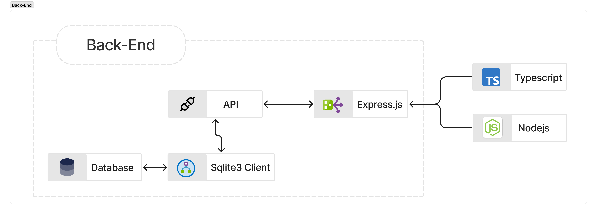

# Introduction to Web Development

## Overview

Web development involves creating and maintaining websites and web applications. This field is divided into two main areas:

- **Front-end development:** Deals with the user interface and experience.
  

- **Back-end development:** Focuses on server-side logic, databases, and application integration.
  

## Introduction to Web Development

Web development is the process of building and maintaining websites. It includes web design, web content development, client-side/server-side scripting, and network security configuration. Web development ranges from creating plain text pages to complex web applications, social network applications, and electronic business applications.

## VS Code

Visual Studio Code (VS Code) is a free, open-source code editor developed by Microsoft. It's lightweight yet powerful, offering features like syntax highlighting, debugging, and Git integration. It supports various programming languages through extensions.

## HTML, CSS, and JavaScript/TypeScript Basics


### HTML (HyperText Markup Language)

HTML is the standard language for creating web pages. It uses elements to structure content. Each element consists of a start tag, content, and an end tag.

#### Basic HTML Structure

```html
<!DOCTYPE html>
<html lang="en">
  <head>
    <meta charset="UTF-8" />
    <meta name="viewport" content="width=device-width, initial-scale=1.0" />
    <title>Web Development Introduction</title>
  </head>
  <body>
    <h1>Welcome to Web Development</h1>
    <p>This is a paragraph of text.</p>
  </body>
</html>
```

### CSS (Cascading Style Sheets)

CSS is used to style HTML elements. It controls layout, colors, fonts, and overall appearance.

#### Basic CSS Syntax

```css
body {
  font-family: Arial, sans-serif;
}
h1 {
  color: blue;
}
p {
  font-size: 16px;
}
```

### JavaScript

JavaScript is a programming language that enables interactive web pages. It can manipulate HTML and CSS, handle events, and perform asynchronous operations.

#### Basic JavaScript Example

```js
  <script>
    document.addEventListener('DOMContentLoaded', function() {
        document.querySelector('h1').textContent = 'Hello, JavaScript!';
      });
  </script>
```

### TypeScript

TypeScript is a superset of JavaScript that adds static types, helping catch errors early through a type system.

#### Basic TypeScript Example

```ts
message: string = "Hello, TypeScript!";
console.log(message);
```

## Tailwind CSS Framework

Tailwind CSS is a utility-first CSS framework that provides low-level utility classes to build custom designs without writing custom CSS.

### Using Tailwind CSS

```css
    <div class="bg-blue-500 text-white p-4 rounded">This is a Tailwind CSS styled box.</div>
```

## Next.js

Next.js is a React framework that enables several powerful features for production, such as server-side rendering and static site generation. It simplifies the process of building React applications by providing a set of tools and conventions for file-based routing, API routes, and more.

### Creating a Next.js Project

1.  **Project Structure:**
    - `pages`: Contains the pages of your application. Each file in this directory corresponds to a route.
    - `public`: Stores static assets like images.

## React

React is a JavaScript library for building user interfaces. It allows you to create reusable components that manage their own state.

### React Components

Components are the building blocks of a React application. They can be functional or class-based. Functional components are the most common in modern React development.

#### Example of a Simple React Component

```ts
    import React from 'react';
    export default function HelloWorld {
      return <h1>Hello, React!</h1>;
    };
```

## TSX (TypeScript with JSX)

TSX allows you to use TypeScript with JSX, the syntax extension for JavaScript that allows you to write HTML directly within JavaScript. TSX enhances your development experience by providing type checking and auto-completion within your JSX code.

### Example of a React Component in TSX

```ts
    import React from 'react';
    export default function HelloWorld: React.FC {
      return <h1>Hello, React with TypeScript!</h1>;
    }
```

### Using React Components in Next.js

1.  **Create a New Component:**
    - Create a file named `page.tsx` in the `app/home` directory:

```ts
      'use client'
      import React from 'react';
      export default function HelloWorld: React.FC {
        return <h1>Hello, React with Next.js!</h1>;
      }
```

## Git Version Control and GitHub

### Git Overview

Git is a distributed version control system that tracks changes in source code during software development. It allows multiple developers to collaborate on projects efficiently and provides a complete history of all changes.

### Basic Git Commands

1.  **Initialize a new Git repository:**

```console
    git init
```

2.  **Clone an existing repository:**

```console
    git clone https://github.com/username/repository-name.git
```

3.  **Basic Git workflow:**

```console
    git add .                    # Stage changes
    git commit -m "Your message" # Commit changes
    git push origin main         # Push to remote repository
```

### GitHub Integration

GitHub is a cloud-based Git repository hosting service that provides additional features like issue tracking, pull requests, and collaborative tools.

#### Creating a Repository on GitHub

1. Go to [GitHub](https://github.com) and sign in
2. Click "New" to create a new repository
3. Add repository name and description
4. Choose public or private
5. Initialize with README if desired

#### Connecting Local Repository to GitHub

```console
    git remote add origin https://github.com/username/repository-name.git
    git branch -M main
    git push -u origin main
```

## SQLite Introduction and CRUD Operations

### SQLite Overview

SQLite is a lightweight, file-based relational database management system. It's self-contained, serverless, and requires zero configuration, making it ideal for development, testing, and small to medium-sized applications.

### Basic SQLite Setup

1.  **Install SQLite (if not already installed):**
    - Download from [sqlite.org](https://sqlite.org/download.html)
    - Or install via package manager

2.  **Create a database:**

```console
    sqlite3 myDatabase.db
```

### Basic SQL CRUD Operations

#### Create Table

```sql
    CREATE TABLE Employees (
        Id INTEGER PRIMARY KEY AUTOINCREMENT,
        Name TEXT NOT NULL,
        Position TEXT NOT NULL,
        Office TEXT,
        Age INTEGER
    );
```

#### Create (Insert)

```sql
    INSERT INTO Employees (Name, Position, Office, Age)
    VALUES ('John Doe', 'Software Engineer', 'New York', 29);
```

#### Read (Select)

```sql
    SELECT * FROM Employees;
    SELECT Name, Position FROM Employees WHERE Age > 25;
```

#### Update

```sql
    UPDATE Employees
    SET Position = 'Senior Software Engineer'
    WHERE Name = 'John Doe';
```

#### Delete

```sql
    DELETE FROM Employees
    WHERE Name = 'John Doe';
```

## Node.js Introduction and SQLite Integration

### Node.js Overview

Node.js is a JavaScript runtime built on Chrome's V8 JavaScript engine. It allows you to run JavaScript on the server side, making it possible to build full-stack applications using JavaScript for both frontend and backend development.

### Setting Up Node.js Project

1.  **Initialize a new Node.js project:**

```console
    npm init -y
```

2.  **Install SQLite3 package:**

```console
    npm install sqlite3
    npm install @types/sqlite3  # For TypeScript support
```

3.  **Create a database connection:**

```js
const sqlite3 = require("sqlite3").verbose();

// Create or open database
const db = new sqlite3.Database("./employees.db", (err) => {
  if (err) {
    console.error("Error opening database:", err.message);
  } else {
    console.log("Connected to SQLite database");
  }
});

// Create table if it doesn't exist
db.serialize(() => {
  db.run(`CREATE TABLE IF NOT EXISTS employees (
        id INTEGER PRIMARY KEY AUTOINCREMENT,
        name TEXT NOT NULL,
        position TEXT NOT NULL,
        office TEXT,
        age INTEGER
      )`);
});
```

### CRUD Operations with Node.js and SQLite

#### Create (Insert)

```js
const insertEmployee = (name, position, office, age) => {
  const stmt = db.prepare(
    "INSERT INTO employees (name, position, office, age) VALUES (?, ?, ?, ?)",
  );
  stmt.run([name, position, office, age], function (err) {
    if (err) {
      console.error("Error inserting employee:", err.message);
    } else {
      console.log(`Employee inserted with ID: ${this.lastID}`);
    }
  });
  stmt.finalize();
};

insertEmployee("Jane Doe", "Product Manager", "San Francisco", 32);
```

#### Read (Select)

```js
const getAllEmployees = () => {
  db.all("SELECT * FROM employees", [], (err, rows) => {
    if (err) {
      console.error("Error fetching employees:", err.message);
    } else {
      rows.forEach((row) => {
        console.log(`${row.name}, ${row.position}, ${row.office}, ${row.age}`);
      });
    }
  });
};

getAllEmployees();
```

#### Update

```js
const updateEmployee = (id, position) => {
  db.run(
    "UPDATE employees SET position = ? WHERE id = ?",
    [position, id],
    function (err) {
      if (err) {
        console.error("Error updating employee:", err.message);
      } else {
        console.log(`Employee updated. Changes: ${this.changes}`);
      }
    },
  );
};

updateEmployee(1, "Senior Product Manager");
```

#### Delete

```js
const deleteEmployee = (id) => {
  db.run("DELETE FROM employees WHERE id = ?", [id], function (err) {
    if (err) {
      console.error("Error deleting employee:", err.message);
    } else {
      console.log(`Employee deleted. Changes: ${this.changes}`);
    }
  });
};

deleteEmployee(1);
```

### Express.js API with SQLite

```js
const express = require("express");
const app = express();
app.use(express.json());

// GET all employees
app.get("/api/employees", (req, res) => {
  db.all("SELECT * FROM employees", [], (err, rows) => {
    if (err) {
      res.status(500).json({ error: err.message });
    } else {
      res.json({ employees: rows });
    }
  });
});

// POST new employee
app.post("/api/employees", (req, res) => {
  const { name, position, office, age } = req.body;
  db.run(
    "INSERT INTO employees (name, position, office, age) VALUES (?, ?, ?, ?)",
    [name, position, office, age],
    function (err) {
      if (err) {
        res.status(500).json({ error: err.message });
      } else {
        res.json({ id: this.lastID, message: "Employee created successfully" });
      }
    },
  );
});

app.listen(3000, () => {
  console.log("Server running on port 3000");
});
```

---

[Table of Contents](00-Cover.md#table-of-contents)
