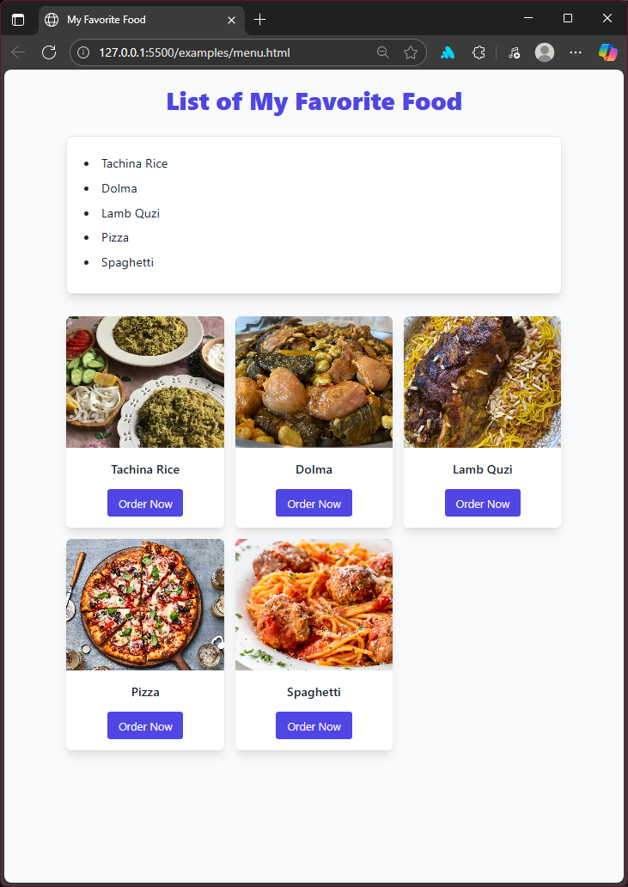

# Homework 01 — Menu page (HTML only)

Goal: Recreate the "List of My Favorite Food" page (the reference is `examples/menu.html`) using only HTML.

Description

The reference file `examples/menu.html` shows a small menu page built with Tailwind CSS. Your task is to recreate the same content and structure but using only HTML. Do not rely on external CSS frameworks or custom stylesheets to achieve the layout or appearance. The focus for this assignment is on structure, semantics, and accessibility using plain HTML.

Requirements

- Create a file named `menu-html-only.html` that contains the following visible content:
  - Page title/header: "List of My Favorite Food"
  - A bulleted list of the your favorite food
  - A set of card-like blocks for each food item with an image, item title, and a non-functional "Order Now" button
- Use only HTML. Specifically:
  - Do NOT include external CSS frameworks (e.g., Tailwind) or external stylesheet links
  - Do NOT include external JavaScript
  - You MAY use basic inline attributes (for example `width`/`height` on images) if needed, but the goal is to rely on semantic HTML structure rather than styling
- Name the file exactly `menu-html-only.html` and place it in your folder.

Reference resources

- The example reference is at `examples/menu.html` in this repository — use it only to copy content and understand structure. You do not need to copy the Tailwind classes.
